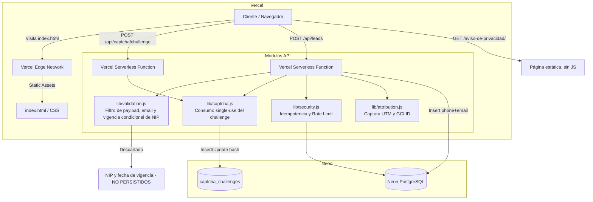

# BAIT Prepago 2 — Arquitectura

Notas Stage 1H:
- `leads.email` se captura para el envío futuro del cupón BAIT (Stage 1I, aún no implementado).
- El NIP sigue sin persistirse; si coincide con los últimos 4 dígitos del teléfono, se exige y valida (no se persiste) una fecha de vigencia dentro de la ventana `hoy..hoy+5` en `America/Mexico_City`.
- El CAPTCHA se resuelve completamente en el servidor: el frontend nunca conoce la respuesta, solo un `challengeId` y una imagen SVG.
