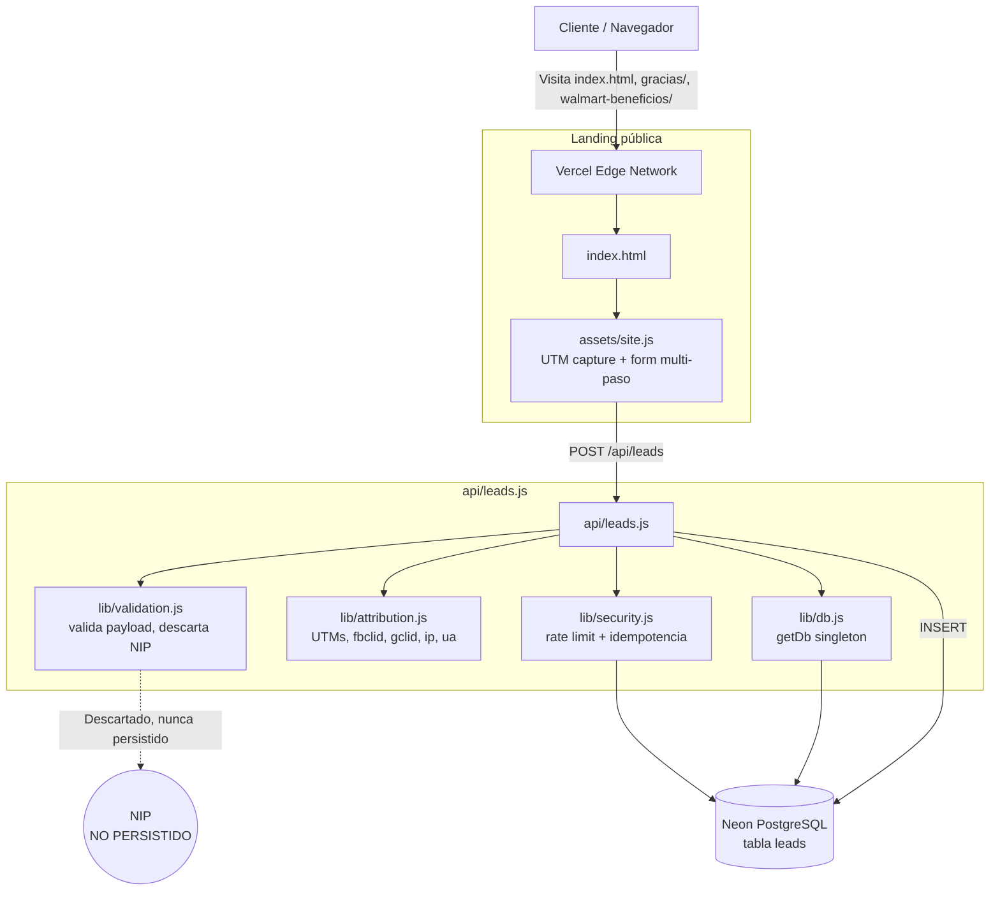
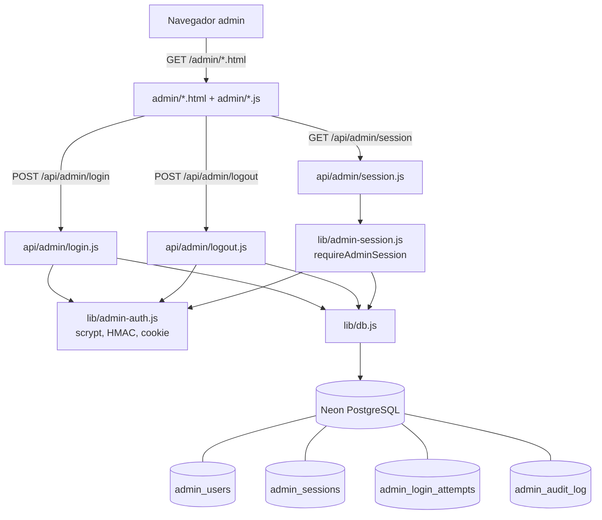
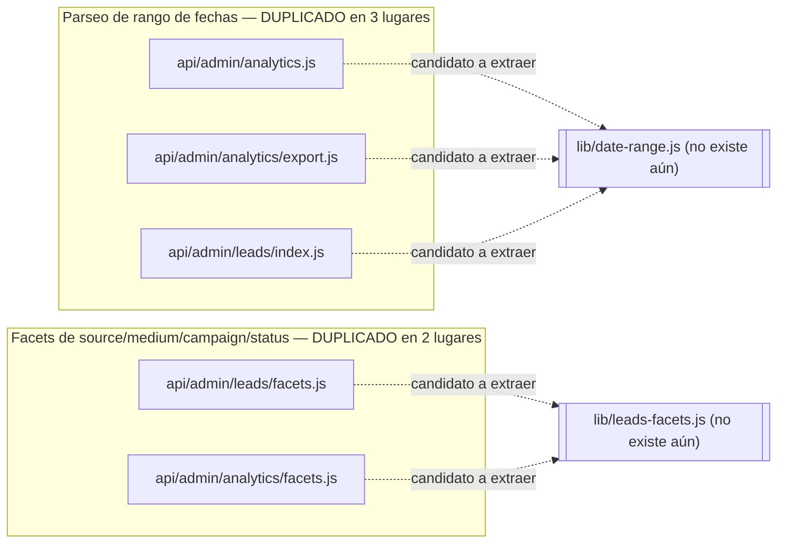

# Grafo de Arquitectura — BAIT Prepago 2

Ver también: [[../Home]] · [[../00-Auditoria-Tecnica]] · [[../04-Indice-de-Funciones]]

> [!TIP] Cómo usar estos diagramas
> Antes de agregar un endpoint, una función de `lib/` o una tabla nueva, ubica aquí dónde encajaría — si ya hay una flecha equivalente, reutilízala en vez de crear una ruta paralela. Esto es lo que evita "emplamar" (duplicar/solapar) módulos y funciones.

## 1. Flujo público de captura de leads

## 2. Panel administrativo — autenticación y sesión

## 3. Panel administrativo — módulos protegidos (dashboard, analítica, leads, usuarios)

```mermaid
flowchart TD
    Guard[lib/admin-session.js<br/>requireAdminSession] --> RBAC[lib/admin-rbac.js<br/>hasRole]

    subgraph Dashboard[" Dashboard / Analítica "]
        Overview[api/admin/overview.js]
        Analytics[api/admin/analytics.js]
        AnalyticsFacets[api/admin/analytics/facets.js]
        AnalyticsExport[api/admin/analytics/export.js]
    end

    subgraph LeadsAdmin[" Gestión de Leads "]
        LeadsList[api/admin/leads/index.js]
        LeadsDetail[api/admin/leads/detail.js]
        LeadsFacets[api/admin/leads/facets.js]
        LeadsSearch[api/admin/leads/search.js]
        LeadsReveal[api/admin/leads/reveal-phone.js]
        LeadsStatus[api/admin/leads/status.js]
        LeadsWorkflow[api/admin/leads/workflow.js]
    end

    subgraph UsersAdmin[" Usuarios / Settings "]
        UsersList[api/admin/users/index.js]
        UsersCreate[api/admin/users/create.js]
        UsersUpdate[api/admin/users/update.js]
        Password[api/admin/settings/password.js]
    end

    RBAC --> Overview & Analytics & AnalyticsFacets & AnalyticsExport
    RBAC --> LeadsList & LeadsDetail & LeadsFacets & LeadsSearch & LeadsReveal & LeadsStatus
    RBAC --> UsersList & UsersCreate & UsersUpdate

    LeadsList & LeadsDetail --> LeadsUtils[lib/leads-utils.js<br/>maskPhone, cursores, sanitizeUrl]
    LeadsSearch --> LeadsUtils
    LeadsStatus --> Workflow[lib/lead-workflow.js<br/>catálogo de estados]
    LeadsWorkflow --> Workflow
    LeadsFacets --> Workflow
    AnalyticsFacets --> Workflow

    LeadsSearch & LeadsReveal & LeadsStatus & AnalyticsExport & UsersCreate & UsersUpdate & Password --> Audit2[lib/admin-audit.js<br/>logAdminAction]
    UsersCreate & Password --> AdminAuth2[lib/admin-auth.js<br/>hashPassword / verifyPassword]

    Overview & Analytics & AnalyticsFacets & AnalyticsExport --> DB3[(leads)]
    LeadsList & LeadsDetail & LeadsFacets & LeadsSearch & LeadsReveal & LeadsStatus --> DB3
    UsersList & UsersCreate & UsersUpdate --> DB4[(admin_users)]
    Password --> DB4
    Audit2 --> DB5[(admin_audit_log)]
```

## 4. Grafo de dependencias `lib/` → `api/` (matriz de reutilización)

Esta tabla es la vista "plana" del grafo anterior — útil para responder rápido *"¿qué se rompe si cambio esta función?"*.

| Módulo `lib/` | Consumido por (`api/`) |
|---|---|
| `db.js` | `leads.js`, todos los `api/admin/**` excepto ninguno (todos lo usan directa o indirectamente vía `admin-session.js`) |
| `admin-auth.js` | `login.js`, `logout.js`, `admin-session.js`, `admin-audit.js`, `users/create.js`, `settings/password.js`, `leads/search.js`, `leads/reveal-phone.js`, `leads/status.js` |
| `admin-session.js` | Todo `api/admin/**` excepto `login.js` |
| `admin-rbac.js` | `analytics.js`, `analytics/facets.js`, `analytics/export.js`, `leads/index.js`, `leads/detail.js`, `leads/facets.js`, `leads/search.js`, `leads/reveal-phone.js`, `users/index.js`, `users/create.js`, `users/update.js` |
| `admin-audit.js` | `analytics/export.js`, `leads/search.js`, `leads/reveal-phone.js`, `leads/status.js` (inline, vía CTE propio), `users/create.js`, `users/update.js`, `settings/password.js` |
| `attribution.js` | `leads.js` |
| `leads-utils.js` | `leads/index.js`, `leads/detail.js`, `leads/search.js` |
| `security.js` | `leads.js` |
| `validation.js` | `leads.js` (directo), `attribution.js` (interno) |
| `lead-workflow.js` | `leads/status.js`, `leads/workflow.js`, `leads/facets.js`, `analytics/facets.js` |

## 5. Notas para evitar duplicación (grafo de "riesgo de re-implementación")

Detalle completo de estas duplicaciones y la recomendación de refactor en [[../04-Indice-de-Funciones]] §"Duplicaciones conocidas a vigilar".
