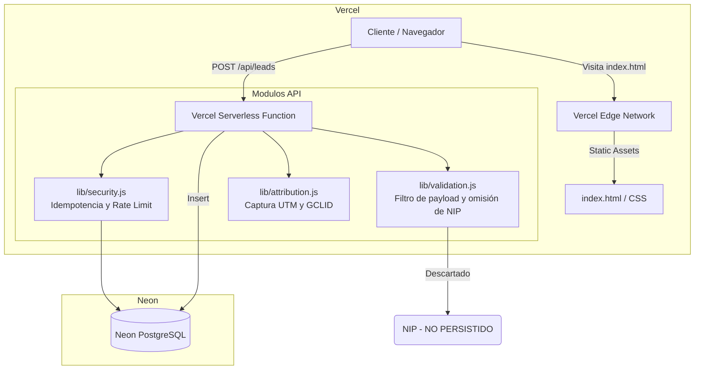

# BAIT Prepago 2 — Arquitectura

```mermaid
flowchart TD
    Client[Cliente / Navegador] -->|Visita index.html| Static[Vercel Edge Network]
    
    subgraph Vercel
        Static -->|Static Assets| index[index.html / CSS]
        Client -->|POST /api/leads| API[Vercel Serverless Function]
        
        subgraph Modulos API
            API --> Validation[lib/validation.js<br>Filtro de payload y omisión de NIP]
            API --> Security[lib/security.js<br>Idempotencia y Rate Limit]
            API --> Attribution[lib/attribution.js<br>Captura UTM y GCLID]
        end
    end
    
    subgraph Neon
        Security --> DB[(Neon PostgreSQL)]
        API -->|Insert| DB
    end
    
    Validation -- Descartado --> PII(NIP - NO PERSISTIDO)
```
