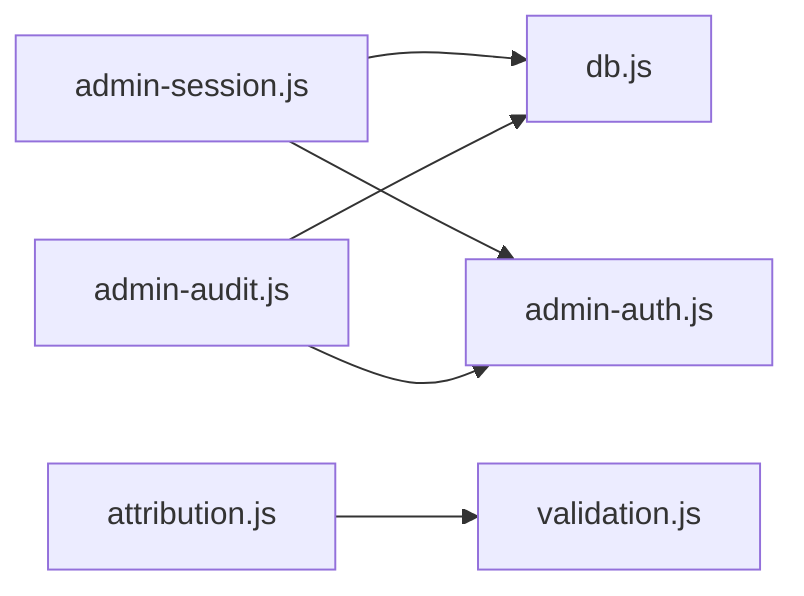

# Módulo: Librerías compartidas (`lib/`)

Ver también: [[Home]] · [[../04-Indice-de-Funciones]] · [[../graph/architecture]]

Capa de utilidades server-side importada por las funciones serverless de `api/`. Ninguna función aquí maneja `req`/`res` directamente (excepto helpers de parseo de cookies/headers) — mantiene la lógica de negocio testeable en aislamiento.

## Archivos

| Archivo | Responsabilidad única |
|---|---|
| `db.js` | Conexión Neon singleton. |
| `admin-auth.js` | Primitivas criptográficas: hashing de password (scrypt), tokens de sesión, cookies, HMAC de identidad, same-origin check. |
| `admin-session.js` | Guardia de sesión centralizada (`requireAdminSession`). |
| `admin-rbac.js` | Enum de roles + chequeo de pertenencia. |
| `admin-audit.js` | Escritura de auditoría con *allowlist* de metadata por acción. |
| `attribution.js` | Extracción de UTMs/Meta/GCLID del request público. |
| `leads-utils.js` | Enmascarado de teléfono, sanitización de URL, cursores de paginación. |
| `security.js` | Rate limiting + idempotencia del endpoint público de leads. |
| `validation.js` | Truncado defensivo + validación de payload de lead. |
| `lead-workflow.js` | Catálogo de estados/motivos y validación de transiciones (fuente única de verdad del workflow). |

El detalle función por función está en [[../04-Indice-de-Funciones]] — **consultar ese índice antes de escribir un helper nuevo**.

## Grafo de dependencias internas de `lib/`

El resto de los módulos (`admin-rbac.js`, `leads-utils.js`, `security.js`, `lead-workflow.js`) no importan de otros módulos de `lib/` — son unidades independientes, lo cual facilita testearlos por separado (ver `tests/admin-auth.js`, `tests/workflow-unit.js`, etc.).

## Convención de módulos

- `db.js`, `admin-auth.js`, `admin-session.js`, `admin-audit.js`, `attribution.js`, `leads-utils.js`, `security.js`, `validation.js` usan **ES Modules** (`import`/`export`).
- `admin-rbac.js` y `lead-workflow.js` usan **CommonJS** (`module.exports`) — inconsistencia menor de formato de módulo dentro de la misma carpeta; funciona porque Node interopera ambos formatos vía extensión `.js` + `"type"` implícito, pero conviene unificar a ESM si se refactoriza `lib/` a futuro.

## Quién consume cada módulo

Ver la tabla cruzada completa en [[../graph/architecture]] ("Grafo lib → api"). Resumen rápido:

- `db.js` — usado por prácticamente todos los endpoints de `api/` y por `db/migrate.js`.
- `admin-session.js` — usado por todos los endpoints de `api/admin/*` salvo `login.js`.
- `admin-auth.js` — usado por `login.js`, `logout.js`, `admin-session.js`, `admin-audit.js`, `users/create.js`, `settings/password.js`, `leads/search.js`, `leads/reveal-phone.js`, `leads/status.js`.
- `admin-rbac.js` — usado por todo endpoint que restringe por rol (todos excepto `login`, `logout`, `session`, `workflow`).
- `lead-workflow.js` — usado por `leads/status.js`, `leads/workflow.js`, `leads/facets.js`, `analytics/facets.js`.
